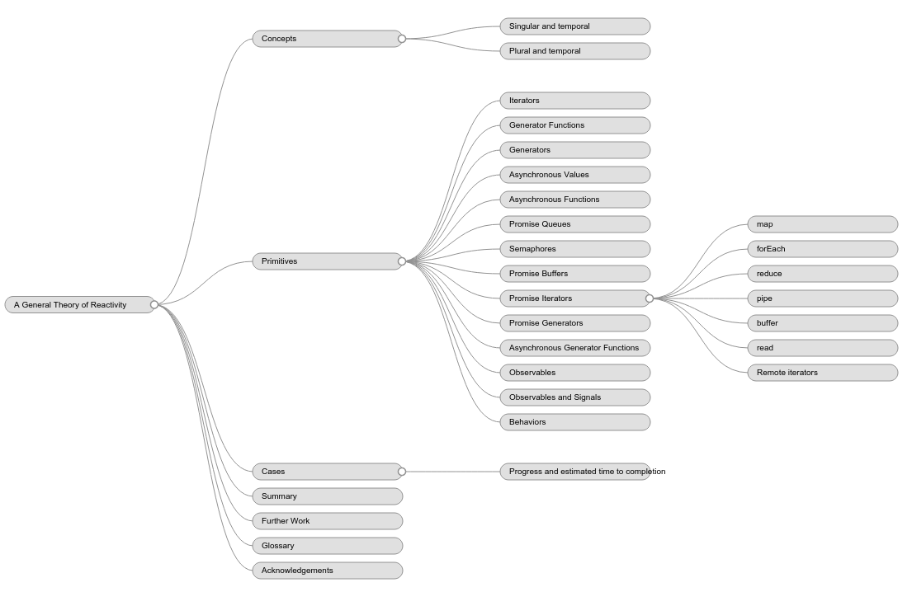
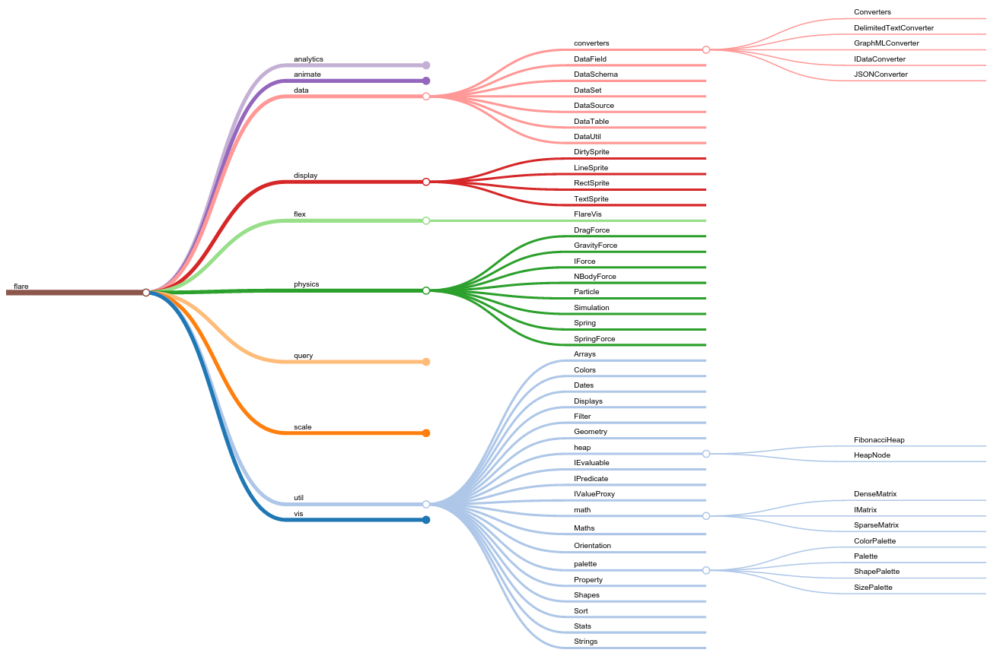

# markmap

*Markmap* is a javascript component that will visualize your markdown documents as mindmaps. It is useful for better navigation and overview of the content. You can see it in action online [here](http://kb.knomaton.org/multi-agent-systems/). It is also used in an [extension](https://atom.io/packages/markdown-mindmap) for Atom editor.

|  |  | 
|:-:|:-:|
| Default style | Colorful style |


## Features

- Zoom in and out with the mouse wheel.
- Pan around by dragging the backgroud.
- Expand/collapse children of a node by clicking on the circle.

Suggestions for new featues are welcome, feel free to open an [issue](https://github.com/dundalek/markmap/issues).

## How to use

Install the component with NPM.
```
npm install markmap
```

Visualizing a markdown text consists of two steps:

1. The text is parsed and transformed into a tree representation.
2. The tree is rendered.

### Parsing

See the file [example.parse.js](examples/example.parse.js) in the examples folder to see how to use the parser.

### Rendering

See the file [example.view.js](examples/example.view.js) in the examples folder to see how to render a mindmap.
